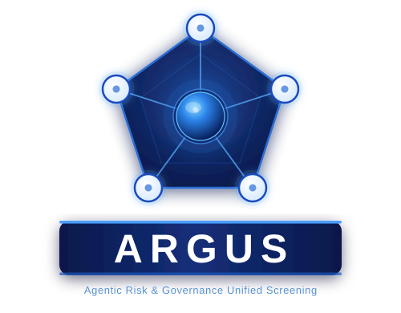
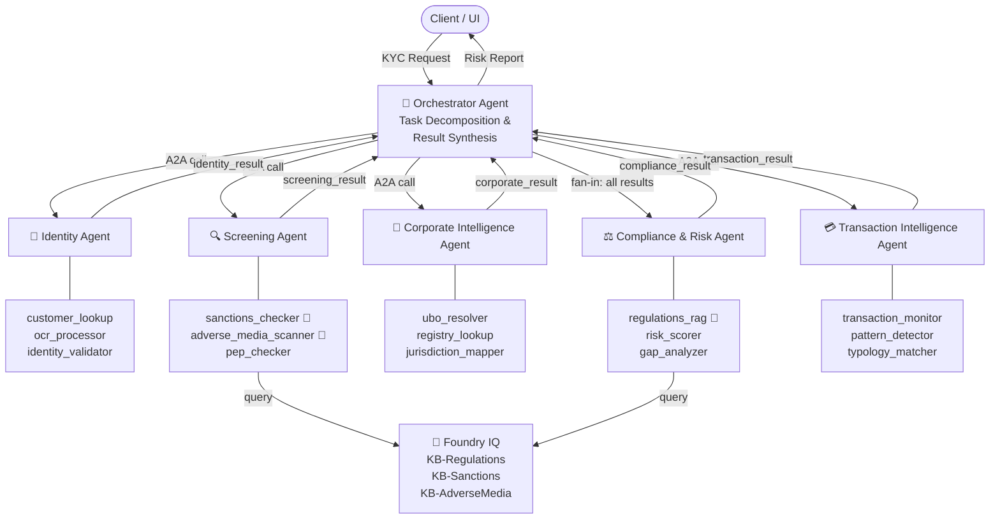

# ARGUS — Agentic Risk & Governance Unified Screening

<p align="center">
     
</p>

[](https://github.com/iarjunganesh/argus/actions/workflows/python-tests.yml)

> **Microsoft Agents League Hackathon 2026 — Reasoning Agents Track**

[](https://ai.azure.com)
[](https://github.com/microsoft/iq-series)
[](https://globalai.community/badges/b35714f6-9372-4716-985f-ad2058722e76/)
[](https://aka.ms/a2a)
[](https://python.org)
[](https://github.com/iarjunganesh/argus/actions)

---

## What is ARGUS?

ARGUS is an open, multi-agent KYC (Know Your Customer) risk assessment system that demonstrates enterprise-grade agentic reasoning applied to financial compliance.

A single KYC request is decomposed into **4 parallel specialist agents plus a compliance fan-in step** coordinated via the **Agent-to-Agent (A2A)** protocol on **Azure AI Foundry**. Knowledge retrieval is powered by **Foundry IQ** — providing cited, grounded, hallucination-resistant answers from regulatory knowledge bases.

**Core entity, transaction, and sanctions datasets are synthetic. The adverse-media demo corpus now also includes public-source summaries for additional demo coverage.**

**Foundry IQ badge status:** Issued (evidence: [Global AI badge](https://globalai.community/badges/b35714f6-9372-4716-985f-ad2058722e76/)).

---

## The Problem

KYC compliance requires a human analyst to simultaneously verify identity,
screen sanctions lists, resolve corporate ownership structures, and assess
regulatory risk. Done manually, this takes 2-5 days per customer and costs
financial institutions billions in compliance overhead annually. A missed
risk can result in multi-million dollar regulatory fines.

## How ARGUS Works

1. Submit an entity name, type, and jurisdiction
2. ARGUS fans out to Identity, Screening, Corporate, and Transaction agents in parallel via the A2A protocol
3. Foundry IQ retrieves cited, grounded answers from regulatory knowledge bases
4. Compliance agent runs as the fan-in step and synthesises a weighted risk score, confidence, plain-English explanation, and action plan
5. Every decision is fully traceable - agent by agent, tool by tool, citation by citation

## Architecture



> 🧠 = Foundry IQ powered tool

See [architecture/ARGUS_Architecture.md](architecture/ARGUS_Architecture.md) for the full spec.

---

## Challenge Tracks

| Track | Prize Target |
|---|---|
| 🧠 Reasoning Agents | Best Reasoning Agent |
| 💡 Microsoft IQ | Best Use of IQ Tools (Foundry IQ × 3 KBs) |

---

## Agents

| Agent | Tools | Foundry IQ |
|---|---|---|
| 🎯 Orchestrator | A2A coordination | — |
| 🪪 Identity | customer_lookup, ocr_processor, identity_validator | — |
| 🔍 Screening | sanctions_checker, adverse_media_scanner, pep_checker | ✅ KB-Sanctions, KB-AdverseMedia |
| 🏢 Corporate Intelligence | ubo_resolver, registry_lookup, jurisdiction_mapper | — |
| ⚖️ Compliance & Risk | regulations_rag, risk_scorer, gap_analyzer | ✅ KB-Regulations |
| 💳 Transaction Intelligence | transaction_monitor, pattern_detector, typology_matcher | — |

---

## Tech Stack

- **Azure AI Foundry Agent Service** — agent hosting + A2A
- **Foundry IQ** — knowledge retrieval (Regulations, Sanctions, Adverse Media)
- **Semantic Kernel** — A2A orchestration
- **Azure OpenAI** (GPT-4o) — reasoning
- **Azure Document Intelligence** — OCR for identity documents
- **Azure Cosmos DB** — synthetic entity/transaction data
- **Azure AI Search** — backing store for Foundry IQ KBs
- **FastAPI** — REST API gateway
- **Gradio** — demo UI

---

## Quick Start

```bash
# 1. Clone
git clone https://github.com/iarjunganesh/argus.git
cd argus

# 2. Install dependencies
pip install -r requirements.txt

# 3. Configure environment (copy template — fill in your Azure credentials)
cp .env.example .env
# Edit .env and add your AZURE_OPENAI_ENDPOINT, COSMOS_ENDPOINT, etc.
# The .env file is gitignored — never commit it.

# 4. Generate synthetic data
make generate-data

# 5. Generate synthetic OCR documents and (optionally) upload them to blob storage
make generate-ocr-docs

# 6. Generate public adverse-media corpus and index into Foundry IQ
python data/public/generate_adverse_media_public.py
make index-knowledge-bases

# 7. Run the API
make run-api

# 8. Start all specialist agents (separate terminals)
make run-identity-agent
make run-screening-agent
make run-corporate-agent
make run-transaction-agent
make run-compliance-agent

# 9. Launch demo UI
make run-ui
```

## Synthetic OCR Documents

ARGUS ships a full synthetic document corpus for OCR robustness demos.

| Doc type | Qualities | Formats | Total |
|---|---|---|---|
| Passport | clean, slightly noisy, degraded, low contrast, photocopy, skewed | PNG + PDF | 12 |
| Driver's licence | same 6 variants | PNG + PDF | 12 |
| National ID card | same 6 variants | PNG + PDF | 12 |
| Tax invoice | same 6 variants | PNG + PDF | 12 |
| **Total** | | | **48** |

Generate locally:

```powershell
make generate-ocr-docs
```

Documents are written to `data/synthetic/ocr_documents/`. A ground-truth manifest is written to `data/synthetic/ocr_documents_manifest.jsonl` and can be fed directly to the existing `ocr_processor` / `identity_validator` pipeline.

To also upload to Azure Blob Storage, add `AZURE_STORAGE_CONNECTION_STRING` to `.env` before running.

---

## Demo & Testing

We've included a demo runbook and a batch-run script to produce sample KYC reports:

- Docs index: docs/README.md
- Demo runbook: docs/DEMO_RUNBOOK.md
- Quick start/stop scripts: scripts/start_demo.ps1, scripts/end_demo.ps1
- Batch KYC runner: scripts/batch_run_kyc.py

Start the full demo stack (all agents + API + Gradio):

```powershell
.\scripts\start_demo.ps1
```

Stop the full demo stack:

```powershell
.\scripts\end_demo.ps1
```

Run the batch runner to create 10 sample reports (saved to data/reports_batch.jsonl):

```powershell
python scripts/batch_run_kyc.py --count 10 --out data/reports_batch.jsonl --poll-timeout 180
```

For stable batch execution, run the API without `--reload` to avoid hot-reload interrupts:

```powershell
python -m uvicorn api.main:app --port 8000
```

Failed batch items are written to `data/reports_batch_errors.jsonl` while successful reports are written to `data/reports_batch.jsonl`.

Logs are emitted in JSON format by all services (see utils/structured_logger.py).

---

## Demo

📹 [Demo Video](https://youtube.com/TODO) *(updated on submission day)*

### Demo Scenarios

| Scenario | Entity | Type | Jurisdiction | Expected Outcome |
|---|---|---|---|---|
| 🔴 High Risk | `Cayman Synth Capital` | corporate | KY | HIGH - Enhanced Due Diligence |
| 🟠 Medium Risk | `Synthetic Holdings B.V.` | corporate | NL | MEDIUM - Elevated monitoring |
| 🟢 Low Risk | `Jane Synthetic` | individual | DE | LOW - Standard onboarding |
| 🔴 Public High Risk | `Wirecard AG` | corporate | DE | HIGH - Enhanced Due Diligence |
| 🟠 Public Medium Risk | `Danske Bank A/S` | corporate | DK | MEDIUM - Elevated monitoring |
| 🟠 Public Medium Risk | `Westpac Banking Corporation` | corporate | AU | MEDIUM - Elevated monitoring |

### What you see in the report

Each ARGUS report surfaces:

- **ARGUS DECISION card** — executive summary showing Risk Tier, Risk Score, Confidence %, Recommendation, and top 3 Primary Drivers at a glance
- **Confidence score** — displayed prominently in the header banner and inside the executive card (e.g. 91%)
- **OCR Visibility strip** — shows the three-step document flow: Upload → Extract → Investigate
- **Risk Dimensions table** — per-dimension score, bar, and tier for Identity / Screening / Corporate / Regulatory / Transaction
- **Investigation Timeline** — per-agent completion timestamps and total latency
- **Foundry IQ citations** — every regulatory trigger cites the knowledge base, source document, and article
- **Recommended Actions** — actionable next steps driven by risk indicators and compliance gaps
- **Audit Trace** — task ID, agents invoked, tool calls, and Foundry IQ query count

### Run the demo

```powershell
# One command to kill existing listeners and start all 7 services:
.\scripts\start_demo.ps1

# Then open: http://localhost:7860

# To stop all demo services:
.\scripts\end_demo.ps1
```

For submission runbook and narration assets, use:

- docs/ARGUS_PreSubmission_Steps.md
- docs/ARGUS_Demo_VoiceOver.txt

---

## Disclaimer

ARGUS is a technology demonstration built for a hackathon. It is not a licensed compliance tool and must not be used to make real KYC/AML decisions. Core test data is synthetic, with a small public-source adverse-media corpus used for demo variety. No affiliation with any financial institution.
