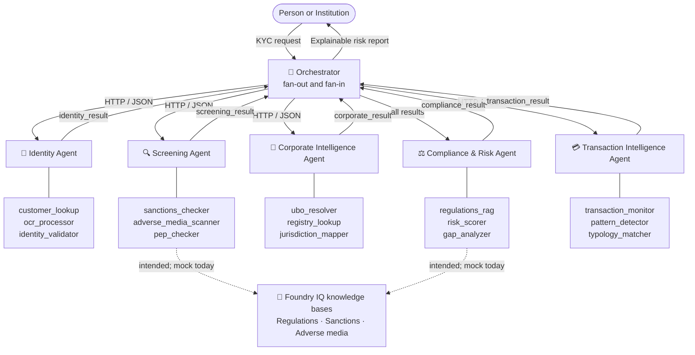

# ARGUS — Agentic Risk & Governance Unified Screening

<p align="center">
  
</p>

<p align="center">
  <strong>Compliance infrastructure that believes financial access is a human right.</strong>
</p>

<p align="center">
  <a href="https://techcommunity.microsoft.com/blog/educatordeveloperblog/%F0%9F%8F%86-agents-league-celebrating-the-builders-who-made-agents-battle-for-glory/4538007"></a>
</p>

<p align="center">
  <a href="https://globalai.community/badges/8261feac-a6a6-4ee9-bc77-4ebecbbf2ce8"></a>
  &nbsp;&nbsp;
  <a href="https://globalai.community/badges/b35714f6-9372-4716-985f-ad2058722e76"></a>
</p>

<!-- Row 1 — status -->
[](https://github.com/iarjunganesh/argus/actions/workflows/ci.yml)
[](https://codecov.io/gh/iarjunganesh/argus)
[](LICENSE)
[](https://youtu.be/yaTNCgCwX4s)

<!-- Row 2 — what the code uses today -->
[](https://www.python.org/)
[](https://fastapi.tiangolo.com/)
[](https://azure.microsoft.com/en-us/products/ai-services/openai-service)
[](https://learn.microsoft.com/azure/search/)
[](https://azure.microsoft.com/en-us/products/cosmos-db)
[](https://gradio.app/)

---

## The quiet cost of bad KYC

A refugee family in Germany spends 18 months trying to open a bank account. Their documents are legitimate. But an automated KYC system — never designed with them in mind — scores their jurisdiction as high risk and closes the case. No human review. No plain-language explanation. No appeal path.

An NGO doing legitimate microfinance work in Southeast Asia gets de-risked by their correspondent bank. The letter cites "risk appetite." The lending operation, which supports 4,000 families, can no longer move money.

These aren't edge cases. **1.4 billion people remain financially excluded globally** — and compliance systems built to protect institutions are a leading cause. The same technology meant to stop financial crime routinely shuts out the people who most need access.

ARGUS exists to change that equation.

Not just by making KYC faster — but by building compliance infrastructure that is **explainable, accessible, open, and designed from the ground up for the humans most likely to be failed by the systems they depend on.**

---

## What ARGUS does

A single KYC request fans out across **five specialist agents**. The Identity, Screening, Corporate and Transaction agents run in parallel; the Compliance & Risk agent combines their results into one risk report. Risk scores, tiers and compliance gaps are computed by deterministic code. A language model writes the plain-English explanation of the decision. The report keeps an audit trail of which agents ran, which tools they called, and the citations each finding rests on.

```text
Submit entity  →  4 agents run in parallel  →  Compliance fan-in  →  Traceable risk report
```

📹 [Watch the demo](https://youtu.be/yaTNCgCwX4s)

### What works today, and what doesn't

ARGUS is being rebuilt after the hackathon. This table is the honest state of the code as of September 2026.

| Capability | Status |
| --- | --- |
| Orchestrator fan-out and fan-in across five agents | ✅ Works. Each agent is its own FastAPI service; they exchange a custom JSON envelope over HTTP. |
| Deterministic risk scoring, tiering and gap analysis | ✅ Works |
| Plain-English decision explanation | ✅ Works with Azure OpenAI GPT-4o or GitHub Models; falls back to a fixed template when no model is configured |
| Cosmos DB entity, ownership and transaction lookups | ✅ Works when configured; falls back to mock records otherwise |
| Azure AI Search typology matching | ✅ Works when configured |
| Azure Document Intelligence OCR | ⚠️ **Not working.** `ocr_processor` imports `azure.ai.formrecognizer`, which isn't a project dependency, so it always returns mock fields. |
| **Foundry IQ knowledge-base queries** (regulations, sanctions, adverse media) | ⚠️ **Not working.** The tools call `AIProjectClient.knowledge_bases.query`, which doesn't exist in `azure-ai-projects` (checked 1.0.0 and 2.6.1), so every query falls back to mock results. Fixing this is part of the rebuild. |
| The six demo scenarios below | ⚠️ Their parallel-agent results come from recorded demo profiles ([`utils/demo_profiles.py`](utils/demo_profiles.py)), not live calls. The compliance fan-in still runs live. |
| Gradio UI | ✅ Works |

Every tool result carries a `source` field (`mock` when a fallback was used), so a report can be checked for which parts were live.

---

## Recognition

ARGUS was selected as **1 of 3 Hack for Good winners** in the Microsoft Agents League — AI Skills Fest 2026. The submission material (runbooks, narration script, slides, original architecture spec) is preserved unchanged in [`archive/hackathon-2026/`](archive/hackathon-2026/).

---

## How ARGUS works



| Agent | Tools | Knowledge source |
| --- | --- | --- |
| 🎯 Orchestrator | fan-out / fan-in coordination | — |
| 🪪 Identity | customer_lookup, ocr_processor, identity_validator | Cosmos DB, Document Intelligence |
| 🔍 Screening | sanctions_checker, adverse_media_scanner, pep_checker | Foundry IQ (intended), Cosmos DB |
| 🏢 Corporate Intelligence | ubo_resolver, registry_lookup, jurisdiction_mapper | Cosmos DB |
| ⚖️ Compliance & Risk | regulations_rag, risk_scorer, gap_analyzer, explain_decision | Foundry IQ (intended), Azure OpenAI |
| 💳 Transaction Intelligence | transaction_monitor, pattern_detector, typology_matcher | Cosmos DB, Azure AI Search |

---

## Where ARGUS is going

The next version is planned in [`docs/ARGUS-V2-PLAN.md`](docs/ARGUS-V2-PLAN.md). In short:

- **A focused experiment first.** Can ARGUS produce simpler explanations while preserving evidence, uncertainty, and the need for human review? It will be measured on a fixed evaluation set and written up, including failures.
- **A simpler runtime.** One process instead of six, built on Microsoft Agent Framework (replacing the custom HTTP envelope), with a Next.js UI replacing Gradio.
- **All three Microsoft IQs.** Foundry IQ for cited regulatory knowledge, Fabric IQ for evaluation data and corporate-ownership relationships, and Work IQ for case-handover context.
- **Neutral where it's cheap.** The model provider, the container host, the tools (MCP) and telemetry can be swapped by configuration. The data plane stays Azure, with a local implementation for tests and self-hosting.

Longer-term ideas, not yet scheduled, live in [`roadmap/`](roadmap/): full WCAG 2.1 AA accessibility, a community edition for NGOs, an open knowledge graph, multimodal identity evidence, and adverse-event alerts. Current starting points in the code:

- [`accessibility/`](accessibility/) has contrast and ARIA utilities. The current risk palette **fails** WCAG AA on white, which a test records as an expected failure.
- [`agents/compliance/tools/explain_decision.py`](agents/compliance/tools/explain_decision.py) has the analyst explanation (wired in) and a plain-language variant (not wired in yet).
- [`community/`](community/) holds a design and configuration sketch; it doesn't run yet.

---

## Demo scenarios

| Scenario | Entity | Type | Jurisdiction | Expected |
| --- | --- | --- | --- | --- |
| 🔴 High Risk | `Cayman Synth Capital` | corporate | KY | HIGH — Enhanced Due Diligence |
| 🟠 Medium Risk | `Synthetic Holdings B.V.` | corporate | NL | MEDIUM — Elevated monitoring |
| 🟢 Low Risk | `Jane Synthetic` | individual | DE | LOW — Standard onboarding |
| 🔴 Public High Risk | `Wirecard AG` | corporate | DE | HIGH — Enhanced Due Diligence |
| 🟠 Public Medium Risk | `Danske Bank A/S` | corporate | DK | MEDIUM — Elevated monitoring |
| 🟠 Public Medium Risk | `Westpac Banking Corporation` | corporate | AU | MEDIUM — Elevated monitoring |

These use recorded demo profiles for the parallel agents (see the status table above).

### What a report shows

- **Decision card** — risk tier, score, confidence, top three drivers
- **Risk dimensions** — score and tier for Identity, Screening, Corporate, Regulatory and Transaction
- **Investigation timeline** — completion time for each agent and total latency
- **Citations** — the knowledge base, source document and article behind each regulatory trigger
- **Recommended actions** — driven by risk indicators and compliance gaps
- **Audit trace** — task ID, agents invoked, tool calls, knowledge-base query count

---

## Quick start

Runs locally without any Azure credentials: every tool falls back to mock data, and the demo scenarios use their recorded profiles.

Requires [uv](https://docs.astral.sh/uv/). It installs the Python version pinned in `.python-version` (3.14) and the locked dependencies.

```bash
git clone https://github.com/iarjunganesh/argus.git
cd argus
uv sync
cp .env.example .env    # optional: add Azure credentials for live calls
```

Start the stack. On Windows, `scripts/start_demo.ps1` starts everything and `scripts/end_demo.ps1` stops it. Elsewhere, start each process in its own terminal:

```bash
uv run uvicorn agents.identity.agent:app --port 8001
uv run uvicorn agents.screening.agent:app --port 8002
uv run uvicorn agents.corporate.agent:app --port 8003
uv run uvicorn agents.transaction.agent:app --port 8004
uv run uvicorn agents.compliance.agent:app --port 8005
uv run uvicorn api.main:app --port 8000
uv run python ui/gradio_app.py    # then open http://localhost:7860
```

Run the same checks as CI:

```bash
uv run ruff check . && uv run ruff format --check .
uv run mypy agents api utils accessibility community ui config.py
uv run pytest --cov
uv run python scripts/check_docs.py
```

To use live Azure services, provision them (`infra/`), generate the synthetic data (`data/synthetic/generate_*.py`, then `data/synthetic/upload_to_cosmos.py`) and index the knowledge bases (`foundry_iq/`).

---

## Contributing

ARGUS is going through a cleanup before the v2 work starts, so the structure is still moving. Issues are welcome. The most useful contributions right now:

1. An accessible risk palette that passes WCAG AA (see the expected failure in `tests/test_accessibility.py`)
2. Translations of explanation output — the people who need plain language most often aren't reading in English

---

## License

Copyright (c) 2026 iarjunganesh.

Licensed under the GNU General Public License v3.0. See [LICENSE](LICENSE).

---

## Disclaimer

ARGUS is a technology demonstration. It is not a licensed compliance tool and must not be used to make real KYC/AML decisions. Core test data is synthetic, with a small public-source adverse-media corpus for demo variety.
