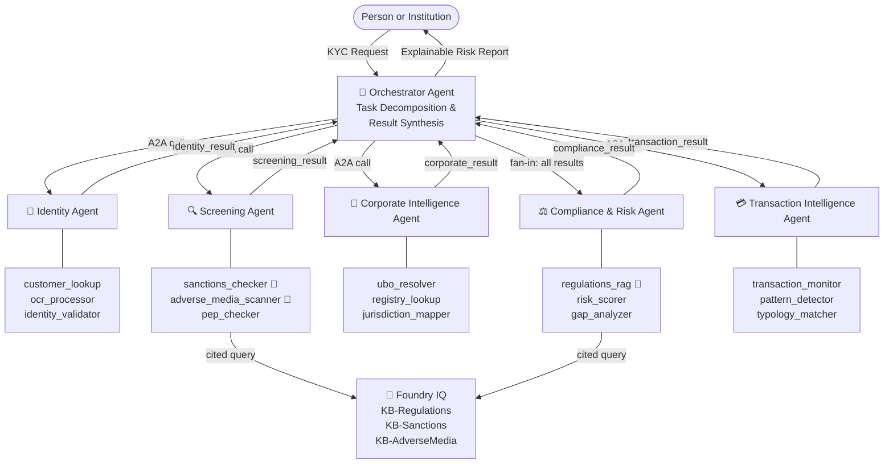

# ARGUS — Agentic Risk & Governance Unified Screening

<p align="center">
  
</p>

<p align="center">
  <strong>Compliance infrastructure that believes financial access is a human right.</strong>
</p>

<p align="center">
  <a href="https://github.com/iarjunganesh/argus"></a>
</p>

<p align="center">
  <em>Microsoft Agents League — AI Skills Fest 2026 · Hack for Good winner (1 of 3).</em>
</p>

<!-- Status -->
<p align="center">
  <a href="https://github.com/iarjunganesh/argus/actions/workflows/python-tests.yml"></a>
  <a href="https://codecov.io/gh/iarjunganesh/argus"></a>
  <a href="LICENSE"></a>
  <a href="https://youtu.be/yaTNCgCwX4s"></a>
</p>

<!-- Tech stack · runtime & orchestration -->
<p align="center">
  
  <a href="https://ai.azure.com"></a>
  <a href="https://learn.microsoft.com/semantic-kernel/"></a>
  <a href="https://aka.ms/a2a"></a>
</p>

<!-- Tech stack · intelligence -->
<p align="center">
  
  <a href="https://globalai.community/badges/b35714f6-9372-4716-985f-ad2058722e76/"></a>
</p>

<!-- Tech stack · data & UI -->
<p align="center">
  
  
  
</p>

---

## The quiet cost of bad KYC

A refugee family in Germany spends 18 months trying to open a bank account. Their documents are legitimate. But an automated KYC system — never designed with them in mind — scores their jurisdiction as high risk and closes the case. No human review. No plain-language explanation. No appeal path.

An NGO doing legitimate microfinance work in Southeast Asia gets de-risked by their correspondent bank. The letter cites "risk appetite." The lending operation, which supports 4,000 families, can no longer move money.

These aren't edge cases. **1.4 billion people remain financially excluded globally** — and compliance systems built to protect institutions are a leading cause. The same technology meant to stop financial crime routinely shuts out the people who most need access.

ARGUS exists to change that equation.

Not just by making KYC faster — but by building compliance infrastructure that is **explainable, accessible, open, and designed from the ground up for the humans most likely to be failed by the systems they depend on.**

---

## What ARGUS does

A single KYC request fans out across **five specialist AI agents** coordinated via the **Agent-to-Agent (A2A) protocol on Azure AI Foundry**. Every finding is grounded in cited regulatory knowledge via **Foundry IQ**. Every risk score comes with a plain-English reason. Every decision leaves a full audit trail — agent by agent, tool by tool, citation by citation.

```
Submit entity  →  5 agents run in parallel  →  Compliance fan-in  →  Traceable risk report
```

The v1 system proves the architecture is solid. This branch is where ARGUS grows up.

📹 [Watch the demo](https://youtu.be/yaTNCgCwX4s)

---

## Why we won

> *"Hack for Good — awarded to the best solutions to solve a community need."*
> ARGUS was selected as **1 of 3 Hack for Good winners** in the Microsoft Agents League — AI Skills Fest 2026.
>
> **Prize package: Azure Credits + GitHub Copilot Pro+ + Swag — FMV $1,468 USD**

### 🌍 Hack for Good

The corporate UBO resolver, jurisdiction risk mapping, and sanctions screener were all built with underserved use cases explicitly in mind: the NGO that gets mistakenly flagged, the microfinance lender whose name matches a sanctions entry, the small business in a high-risk jurisdiction that is doing everything right.

Accessibility runs through the same work — a report UI that reads cleanly in light and dark mode, uses semantic HTML, and surfaces every critical data point (risk tier, confidence, driver reasoning) without hiding it behind clicks or jargon; an OCR pipeline built for degraded, skewed, and low-contrast documents, because the people who submit those are the ones who need KYC to work most reliably. See the [v2 roadmap](#argus-v2--whats-next) for where that goes next.

The prize validated the direction. The v2 community edition makes it real.

---

## How ARGUS Works



> 🧠 = Foundry IQ powered — every answer is cited, grounded, and hallucination-resistant.

---

## ARGUS v2 — What's Next

This branch is the sketchpad for what ARGUS becomes after the hackathon. These aren't hypothetical — each has a scaffold in [`roadmap/`](roadmap/) and initial code in the linked module.

| Feature | Status | Module |
|---|---|---|
| ♿ Full WCAG 2.1 AA compliance | 🔨 In progress | [`accessibility/`](accessibility/) |
| 🗣 Explain Mode — plain language reports | 🔨 In progress | [`agents/explain/`](agents/explain/) |
| 🌍 Community Edition — free for NGOs | 📐 Designed | [`community/`](community/) |
| 📊 Real-time Azure Monitor dashboard | 📐 Designed | [`observability/`](observability/) |
| 🔓 Open Knowledge Graph | 🔮 Planned | [`roadmap/open-kg.md`](roadmap/open-kg.md) |
| 🎙 Voice input + liveness detection | 🔮 Planned | [`roadmap/multimodal.md`](roadmap/multimodal.md) |
| 🔔 ARGUS Witness — adverse event alerts | 🔮 Planned | [`roadmap/witness.md`](roadmap/witness.md) |

---

### 1. Full WCAG 2.1 AA Compliance

The current UI passes visual inspection. v2 makes it certified.

- ARIA live regions for async agent results (screen readers hear progress as it happens)
- Keyboard-navigable report cards with logical focus order
- WCAG-AA color contrast enforced programmatically — no more relying on theme defaults
- Color-blind safe palette (no red/green-only signals — shape and text always carry the meaning too)
- High-contrast mode toggle persisted in `localStorage`
- `prefers-reduced-motion` respected for all animated transitions

```python
# accessibility/wcag.py — ships in this branch
from accessibility.wcag import assert_contrast_ratio, WCAGLevel

assert_contrast_ratio("#e74c3c", "#ffffff", level=WCAGLevel.AA)  # HIGH risk red
assert_contrast_ratio("#2ecc71", "#ffffff", level=WCAGLevel.AA)  # LOW risk green
```

See [`accessibility/`](accessibility/) for the full module.

---

### 2. ARGUS Explain Mode — Plain Language Reports

The current report is built for compliance analysts. Explain Mode generates a parallel version for the person being screened — or the NGO caseworker who has to explain a decision to a family.

Instead of:
> *"Dimension score 78 — HIGH tier — regulatory trigger: FATF Recommendation 16 (KB-Regulations › FATF-40 › R.16)"*

Explain Mode says:
> *"This account review flagged a potential concern with how money moved through the transaction chain. This is a standard check for large or cross-border transfers. A compliance officer will review this before a final decision is made. You don't need to do anything right now."*

Same underlying data. Different audience. Entirely different outcome for the person on the receiving end.

Routing is via a new `explain_decision` tool already wired into the Compliance Agent — see [`agents/compliance/tools/explain_decision.py`](agents/compliance/tools/explain_decision.py).

---

### 3. Community Edition — Free for NGOs & Microfinance

The biggest v2 bet. ARGUS Community Edition is a zero-cost, self-hostable configuration for:

- **NGOs** navigating correspondent banking restrictions
- **Microfinance institutions** running KYC at scale on thin margins
- **Community banks** serving underbanked populations
- **Researchers** studying financial exclusion patterns

Community Edition ships with:
- A pre-seeded public knowledge base (FATF, Basel AML Index, open sanctions lists)
- A one-command Docker Compose stack (no Azure subscription required for the core flow)
- A lower-cost LLM path (GPT-4o-mini by default, configurable)
- An NGO onboarding guide and sample entity dataset representing common false-positive patterns

```bash
# One command. No cloud credentials needed for the base flow.
docker compose -f community/docker-compose.yml up
```

See [`community/`](community/) for the full spec and [`roadmap/community-edition.md`](roadmap/community-edition.md) for the rollout plan.

---

### 4. Open Knowledge Graph

Today ARGUS's regulatory knowledge lives in private Foundry IQ knowledge bases. The Open KG ships the base regulatory corpus as structured, versioned, open data:

- FATF 40 Recommendations (structured JSON)
- Basel AML Index country risk scores (CC-BY)
- Open Sanctions data (already open — we contribute back)
- OFAC/EU/UN consolidated lists (public domain)

Why open? Because the NGOs and microfinance lenders who need this most are the ones who can't afford licensed compliance data feeds. If the knowledge that decides who gets a bank account is locked behind a paywall, the system stays broken.

---

### 5. Real-Time Compliance Dashboard

The `observability/` scaffolding that shipped in v1.4 gets real Azure Monitor integration:

- Live agent latency per tool call
- Risk tier distribution over rolling 24h window
- False-positive rate tracker (manually confirmed vs. ARGUS decision)
- Foundry IQ cache hit ratio
- Alert rules for anomalous screening volume spikes

---

## Current Architecture (v1)

| Agent | Tools | Foundry IQ |
|---|---|---|
| 🎯 Orchestrator | A2A coordination | — |
| 🪪 Identity | customer_lookup, ocr_processor, identity_validator | — |
| 🔍 Screening | sanctions_checker, adverse_media_scanner, pep_checker | ✅ KB-Sanctions, KB-AdverseMedia |
| 🏢 Corporate Intelligence | ubo_resolver, registry_lookup, jurisdiction_mapper | — |
| ⚖️ Compliance & Risk | regulations_rag, risk_scorer, gap_analyzer | ✅ KB-Regulations |
| 💳 Transaction Intelligence | transaction_monitor, pattern_detector, typology_matcher | — |

---

## Tech Stack

| Layer | Current (v1) | Planned (v2) |
|---|---|---|
| Agent hosting |  | + Community Docker |
| Knowledge retrieval |  | + Open KG (public corpus) |
| Orchestration |   | unchanged |
| Reasoning |  | + GPT-4o-mini (community path) |
| OCR |  | + Tesseract (community) |
| Entity store |  | + SQLite (community) |
| Search |  | + Qdrant (community) |
| UI |  | + WCAG 2.1 AA certified |
| Observability |  | Azure Monitor + Grafana dashboard |

---

## Demo Scenarios

| Scenario | Entity | Type | Jurisdiction | Expected |
|---|---|---|---|---|
| 🔴 High Risk | `Cayman Synth Capital` | corporate | KY | HIGH — Enhanced Due Diligence |
| 🟠 Medium Risk | `Synthetic Holdings B.V.` | corporate | NL | MEDIUM — Elevated monitoring |
| 🟢 Low Risk | `Jane Synthetic` | individual | DE | LOW — Standard onboarding |
| 🔴 Public High Risk | `Wirecard AG` | corporate | DE | HIGH — Enhanced Due Diligence |
| 🟠 Public Medium Risk | `Danske Bank A/S` | corporate | DK | MEDIUM — Elevated monitoring |
| 🟠 Public Medium Risk | `Westpac Banking Corporation` | corporate | AU | MEDIUM — Elevated monitoring |

### What a report surfaces

- **ARGUS Decision card** — Risk Tier, Score, Confidence, top 3 primary drivers
- **Explain Mode toggle** (v2) — human-readable version of the same finding
- **Risk Dimensions table** — per-dimension score and tier: Identity / Screening / Corporate / Regulatory / Transaction
- **Investigation Timeline** — per-agent completion timestamps and total latency
- **Foundry IQ citations** — every regulatory trigger cites the KB, source document, and article
- **Recommended Actions** — driven by risk indicators and compliance gaps
- **Audit Trace** — task ID, agents invoked, tool calls, Foundry IQ query count

---

## Quick Start

```bash
# 1. Clone
git clone https://github.com/iarjunganesh/argus.git
cd argus

# 2. Install dependencies
pip install -r requirements.txt

# 3. Configure environment
cp .env.example .env
# Fill in your Azure credentials

# 4. Generate synthetic data
make generate-data
make generate-ocr-docs

# 5. Index knowledge bases
python data/public/generate_adverse_media_public.py
make index-knowledge-bases

# 6. Run the full stack
.\scripts\start_demo.ps1
# Then open: http://localhost:7860
```

For the **Community Edition** (no Azure subscription required):

```bash
docker compose -f community/docker-compose.yml up
# Then open: http://localhost:7860
```

---

## Contributing

This branch is the v2 sketchpad. PRs that advance any item in the [roadmap](roadmap/) are welcome.

The most needed contributions right now:
1. WCAG contrast ratio tests for every color token in the Gradio theme
2. Translations of the Explain Mode output (the people who need plain language most often aren't reading in English)
3. Community Edition Docker Compose hardening and a one-click Railway deploy button

---

## License

MIT. See [LICENSE](LICENSE).

For the submission artifacts, see:
- [`submission/ARGUS_FINAL_DEMO_RUNBOOK.md`](submission/ARGUS_FINAL_DEMO_RUNBOOK.md)
- [`submission/ARGUS_FINAL_AUDIO_SCRIPT.md`](submission/ARGUS_FINAL_AUDIO_SCRIPT.md)

---

## Disclaimer

ARGUS is a technology demonstration. It is not a licensed compliance tool and must not be used to make real KYC/AML decisions. Core test data is synthetic, with a small public-source adverse-media corpus for demo variety.
