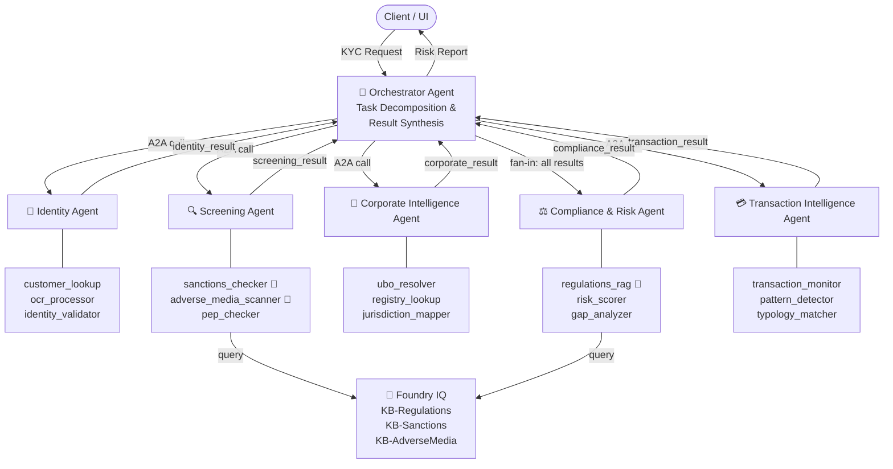

# ARGUS — Agentic Risk & Governance Unified Screening
### *Microsoft Agents League Hackathon 2026 — Reasoning Agents Track*

> **Alternative names:** AEGIS (Agentic Entity Governance & Identity Screening) · ARIA (Agentic Risk Intelligence Assessor)

---

## Table of Contents

1. [Overview](#1-overview)
2. [Problem Statement](#2-problem-statement)
3. [Hackathon Track & Prize Alignment](#3-hackathon-track--prize-alignment)
4. [High-Level Architecture](#4-high-level-architecture)
5. [Agent Topology (A2A)](#5-agent-topology-a2a)
6. [Orchestrator Agent](#6-orchestrator-agent)
7. [Sub-Agent Specifications](#7-sub-agent-specifications)
8. [Tool Inventory](#8-tool-inventory)
9. [Foundry IQ Integration](#9-foundry-iq-integration)
10. [Azure Services Stack](#10-azure-services-stack)
11. [Synthetic Data Strategy](#11-synthetic-data-strategy)
12. [A2A Protocol Flow](#12-a2a-protocol-flow)
13. [Risk Report Output Schema](#13-risk-report-output-schema)
14. [API Surface](#14-api-surface)
15. [Observability & AgentOps](#15-observability--agentops)
16. [Scope Boundary](#16-scope-boundary)
17. [Judging Criteria Alignment](#17-judging-criteria-alignment)
18. [Submission Requirements Checklist](#18-submission-requirements-checklist)
19. [Setup & Bootstrap Guide](#19-setup--bootstrap-guide)
20. [Repository Structure](#20-repository-structure)

---

## 1. Overview

**ARGUS** is an open, portfolio-grade, multi-agent KYC (Know Your Customer) risk assessment system built on **Azure AI Foundry** using the **Agent-to-Agent (A2A)** protocol. It demonstrates enterprise-grade agentic reasoning applied to financial compliance — decomposing a complex KYC request into parallel, specialised sub-agent workflows that reason across identity, screening, corporate intelligence, compliance regulations, and transaction behaviour.

The knowledge intelligence layer is powered by **Foundry IQ** — Microsoft's managed knowledge retrieval system — providing cited, grounded, permission-aware answers across all regulatory and screening knowledge bases. This directly addresses the hackathon's mandatory IQ integration requirement.

All data is **100% synthetic**. ARGUS has no affiliation with any financial institution.

| Attribute | Value |
|---|---|
| Hackathon | Microsoft Agents League 2026 |
| Track | Reasoning Agents |
| IQ Layer | **Foundry IQ** (mandatory requirement ✅) |
| Platform | Azure AI Foundry Agent Service |
| Pattern | Orchestrator + A2A Sub-Agents |
| Framework | Semantic Kernel (A2A) + Azure AI Foundry SDK |
| Language | Python |
| Data | Fully synthetic (no real PII or financial data) |

---

## 2. Problem Statement

KYC compliance is a multi-dimensional reasoning task. A human compliance analyst must simultaneously:

- **Verify identity** — Is this entity who they claim to be?
- **Screen for risk** — Are they on sanctions lists? In adverse news?
- **Resolve corporate structure** — Who ultimately owns/controls this entity?
- **Assess regulatory exposure** — Which regulations apply? Where are the gaps?
- **Monitor behaviour** — Do their transactions match their stated profile?

Each dimension requires specialist expertise and distinct data sources. Traditional systems handle these sequentially in siloed pipelines. An A2A agent architecture mirrors how a real compliance team actually works — specialist agents in parallel, coordinated by an orchestrator who synthesises the full picture into a risk decision.

**Why Foundry IQ specifically matters here:** Compliance decisions require cited, auditable evidence. Foundry IQ's grounded retrieval with citations maps directly onto the audit trail regulators demand — making it not just a technical choice but a domain-appropriate one.

---

## 3. Hackathon Track & Prize Alignment

**Track: Reasoning Agents** — *Create intelligent agents using Microsoft Foundry that solve complex problems through multi-step reasoning.*

ARGUS is eligible for **two prize categories simultaneously:**

| Prize | Value | ARGUS eligibility |
|---|---|---|
| 🧠 Best Reasoning Agent | $5,000 | Primary track — A2A multi-step KYC reasoning |
| 💡 Best Use of IQ Tools | $5,000 | Foundry IQ powers 3 core tools (regulations, sanctions, adverse media) |
| 🏆 Best Overall Agent | $15,000 | Competes across all tracks if strongest submission |

ARGUS demonstrates across all judging criteria:

| Criterion | How ARGUS delivers |
|---|---|
| Multi-step reasoning | KYC decomposed into 5 reasoning chains across specialist agents |
| Azure AI Foundry | Orchestrator + all sub-agents hosted on Foundry Agent Service |
| A2A protocol | Sub-agents called via A2A endpoints; results aggregated by orchestrator |
| **Foundry IQ (mandatory)** | **3 knowledge bases powering regulations, sanctions, adverse media tools** |
| Enterprise realism | Real regulatory frameworks (FATF, GDPR), realistic entity/doc types |
| Observability | AgentOps via Azure Monitor; per-agent trace and token accounting |

---

## 4. High-Level Architecture

```
┌──────────────────────────────────────────────────────────────────────────┐
│                          ARGUS System Boundary                           │
│                                                                          │
│  ┌──────────────┐     REST/A2A      ┌───────────────────────────────┐   │
│  │   Client UI  │ ─────────────── ▶ │     ARGUS Orchestrator        │   │
│  │  (Gradio /   │ ◀ ─────────────   │     (Azure AI Foundry)        │   │
│  │   FastAPI)   │    Risk Report    │     GPT-4o  |  Sem.Kernel     │   │
│  └──────────────┘                   └─────────────┬─────────────────┘   │
│                                                   │ A2A Protocol        │
│          ┌──────────────────────────────────────┬─┴────────────────┐    │
│          │                                      │                  │    │
│ ┌────────▼──────┐  ┌─────────────────┐  ┌──────▼──────┐  ┌───────▼──┐ │
│ │   Identity    │  │   Screening     │  │  Corporate  │  │ Transact │ │
│ │    Agent      │  │     Agent       │  │  Intel Agent│  │ Intel Agt│ │
│ │ • cust_lookup │  │ • sanctions ─── ┼─▶│ • ubo_rslvr │  │ • tx_mon │ │
│ │ • ocr_proc    │  │   [Foundry IQ] │  │ • reg_lookup│  │ • pattern│ │
│ │ • id_validate │  │ • adv_media ───┼─▶│ • jrsd_map  │  │ • typol  │ │
│ └───────────────┘  │   [Foundry IQ] │  └─────────────┘  └──────────┘ │
│                    │ • pep_checker   │                                  │
│                    └─────────────────┘                                  │
│                                                                          │
│          ┌───────────────────────────────────────────────────────────┐  │
│          │           Compliance & Risk Agent  (fan-in)               │  │
│          │   • regulations_rag [Foundry IQ] • risk_scorer            │  │
│          │   • gap_analyzer                                           │  │
│          └───────────────────────────────────────────────────────────┘  │
│                                                                          │
│  ┌──────────────────────────────────────────────────────────────────┐   │
│  │                    Foundry IQ Intelligence Layer                  │   │
│  │  KB-Regulations │ KB-Sanctions │ KB-AdverseMedia │ KB-Typologies │   │
│  └──────────────────────────────────────────────────────────────────┘   │
│  ┌──────────────────────────────────────────────────────────────────┐   │
│  │                       Azure Data Plane                            │   │
│  │   Cosmos DB │ AI Search │ Doc Intelligence │ Blob Storage         │   │
│  └──────────────────────────────────────────────────────────────────┘   │
└──────────────────────────────────────────────────────────────────────────┘
```

---

## 5. Agent Topology (A2A)



> 🧠 = Foundry IQ powered tool

**Execution model:** Orchestrator fires IDA, SCA, CIA, and TIA in **parallel** (fan-out). CRA runs **after** all four complete, since risk scoring requires all upstream findings as input (fan-in). This dependency-aware orchestration is a key reasoning demonstration.

---

## 6. Orchestrator Agent

### Role
The Orchestrator is the entry point for all KYC requests. It acts as a **reasoning planner**: it understands the request, decomposes it into sub-tasks, routes to appropriate sub-agents via A2A, awaits results, and synthesises a structured Risk Report.

### Responsibilities
- Parse and validate incoming KYC request
- Determine which sub-agents are relevant (entity type: individual vs. corporate determines UBO relevance)
- Issue A2A calls, tracking per-agent SLA
- Handle partial failures gracefully (flag unavailable agents, proceed with available findings)
- Synthesise sub-agent outputs into a unified risk narrative
- Assign final risk tier and confidence score
- Return structured Risk Report + audit trace

### System Prompt (excerpt)
```
You are ARGUS Orchestrator, a financial compliance reasoning agent.
You coordinate specialist agents to perform a complete KYC assessment.
You reason step-by-step, cite evidence from each agent's findings,
and produce a structured, auditable risk decision.
You never hallucinate regulatory rules — you cite only what the
Compliance Agent has retrieved from the Foundry IQ regulations knowledge base.
All citations must include the source document and knowledge base reference.
```

### Azure Foundry Config
```yaml
agent_id: argus-orchestrator-v1
model: gpt-4o
tools:
  - type: a2a_endpoint
    target: identity-agent
  - type: a2a_endpoint
    target: screening-agent
  - type: a2a_endpoint
    target: corporate-intelligence-agent
  - type: a2a_endpoint
    target: compliance-risk-agent
  - type: a2a_endpoint
    target: transaction-intelligence-agent
memory: enabled          # Foundry managed memory (preview)
tracing: azure_monitor
```

---

## 7. Sub-Agent Specifications

### 7.1 Identity Agent

**Purpose:** Verify that the entity is who they claim to be, using registry lookups and document OCR.

| Attribute | Detail |
|---|---|
| Agent ID | `argus-identity-agent-v1` |
| Model | `gpt-4o` |
| Tools | `customer_lookup`, `ocr_processor`, `identity_validator` |
| Input | Entity name, type, DOB/registration number, document images (base64) |
| Output | `identity_result` — verified fields, confidence, discrepancies |
| Foundry IQ | ❌ Not required — queries Cosmos DB directly |

**Reasoning chain:**
1. Look up entity in synthetic customer registry (Cosmos DB)
2. If documents provided → OCR extraction per document type (Azure Document Intelligence)
3. Cross-reference extracted fields against registry record
4. Flag discrepancies (name mismatch, DOB delta, expired document, etc.)
5. Return identity confidence score (0–100) + evidence list

---

### 7.2 Screening Agent

**Purpose:** Screen the entity against global watchlists, adverse media, and PEP databases.

| Attribute | Detail |
|---|---|
| Agent ID | `argus-screening-agent-v1` |
| Model | `gpt-4o` |
| Tools | `sanctions_checker` 🧠, `adverse_media_scanner` 🧠, `pep_checker` |
| Input | Entity name, aliases, nationality, date of birth |
| Output | `screening_result` — hit list per source, match confidence, cited snippets |
| Foundry IQ | ✅ **KB-Sanctions + KB-AdverseMedia** |

**Reasoning chain:**
1. Query **Foundry IQ KB-Sanctions** — fuzzy-match entity against synthetic OFAC/UN/EU/UK schema data; receive cited, grounded match results
2. Query **Foundry IQ KB-AdverseMedia** — semantic search over synthetic news corpus; receive cited article snippets
3. Check PEP synthetic dataset directly (Cosmos DB) for political exposure
4. Deduplicate, rank hits by match confidence
5. Return per-source hit/no-hit + Foundry IQ citations as evidence

---

### 7.3 Corporate Intelligence Agent

**Purpose:** Resolve the ultimate beneficial owner (UBO) structure and map corporate relationships.

| Attribute | Detail |
|---|---|
| Agent ID | `argus-corporate-agent-v1` |
| Model | `gpt-4o` |
| Tools | `ubo_resolver`, `registry_lookup`, `jurisdiction_mapper` |
| Input | Entity name, registration number, jurisdiction |
| Output | `corporate_result` — ownership graph, UBO list, jurisdiction risk |
| Foundry IQ | ❌ Not required — queries Cosmos DB graph directly |

**Reasoning chain:**
1. Look up entity in synthetic corporate registry (Cosmos DB)
2. Traverse ownership graph recursively until individuals (>25% threshold) or depth limit (5 levels)
3. For each node: check jurisdiction risk tier via static config
4. Identify circular ownership, shell company indicators, high-risk jurisdiction hops
5. Return ownership tree + UBO list + structural risk flags

---

### 7.4 Compliance & Risk Agent

**Purpose:** Map applicable regulatory requirements, assess compliance gaps, and produce a calibrated risk score. **Runs last — requires all upstream agent results.**

| Attribute | Detail |
|---|---|
| Agent ID | `argus-compliance-agent-v1` |
| Model | `gpt-4o` |
| Tools | `regulations_rag` 🧠, `risk_scorer`, `gap_analyzer` |
| Input | All upstream agent results (identity, screening, corporate, transaction) |
| Output | `compliance_result` — applicable regs with citations, gaps, risk score, actions |
| Foundry IQ | ✅ **KB-Regulations** (FATF 40, 4AMLD/6AMLD, GDPR Art.9, DORA) |

**Reasoning chain:**
1. Determine applicable regulatory frameworks (entity type, jurisdiction, sector)
2. Query **Foundry IQ KB-Regulations** — retrieve relevant FATF recommendations, AML directive articles, with citations
3. Map findings from all upstream agents against retrieved regulatory requirements
4. Identify compliance gaps (what's triggered, what evidence exists, what's missing)
5. Compute weighted risk score across five dimensions:
   - Identity risk (25%)
   - Screening risk (30%)
   - Corporate/UBO risk (20%)
   - Regulatory gap risk (15%)
   - Transaction risk (10%)
6. Assign risk tier: Low / Medium / High / Critical
7. Generate cited remediation actions, referencing Foundry IQ source documents

---

### 7.5 Transaction Intelligence Agent

**Purpose:** Analyse synthetic transaction history for anomalous patterns and money laundering typologies.

| Attribute | Detail |
|---|---|
| Agent ID | `argus-transaction-agent-v1` |
| Model | `gpt-4o` |
| Tools | `transaction_monitor`, `pattern_detector`, `typology_matcher` |
| Input | Entity ID, synthetic transaction ledger (last 12 months) |
| Output | `transaction_result` — flagged patterns, typology hits, behavioural score |
| Foundry IQ | ❌ Pattern matching runs locally; FATF typology index via AI Search |

**Reasoning chain:**
1. Load synthetic transaction history from Cosmos DB
2. Compute baseline statistics (avg value, frequency, counterparty diversity)
3. Detect structuring signals (multiple transactions just below reporting threshold)
4. Detect layering signals (rapid movement across multiple accounts)
5. Match against FATF money laundering typologies (public domain)
6. Score transaction risk and flag specific transactions as evidence

---

## 8. Tool Inventory

| # | Tool | Agent | Foundry IQ | Data Source | Description |
|---|---|---|---|---|---|
| 1 | `customer_lookup` | Identity | ❌ | Cosmos DB (synthetic) | Retrieves entity profile: name, DOB, address, registration details |
| 2 | `ocr_processor` | Identity | ❌ | Azure Document Intelligence | Extracts structured fields from passport, driver's licence, tax invoice, ID card |
| 3 | `identity_validator` | Identity | ❌ | Internal | Cross-references OCR output against registry; flags discrepancies |
| 4 | `sanctions_checker` | Screening | ✅ **KB-Sanctions** | Foundry IQ | Grounded, cited fuzzy-match against synthetic OFAC/UN/EU/UK-schema lists |
| 5 | `adverse_media_scanner` | Screening | ✅ **KB-AdverseMedia** | Foundry IQ | Cited semantic search over synthetic news corpus for negative coverage |
| 6 | `pep_checker` | Screening | ❌ | Cosmos DB (synthetic PEP) | Checks entity and close associates against PEP database |
| 7 | `ubo_resolver` | Corporate | ❌ | Cosmos DB (corporate graph) | Recursive graph traversal to identify ultimate beneficial owners |
| 8 | `registry_lookup` | Corporate | ❌ | Cosmos DB (corp registry) | Retrieves incorporation details, directors, shareholders |
| 9 | `jurisdiction_mapper` | Corporate | ❌ | Static config | Maps country codes to FATF risk tiers and special measures |
| 10 | `regulations_rag` | Compliance | ✅ **KB-Regulations** | Foundry IQ | Cited RAG over FATF 40 Recs, 4AMLD/6AMLD, GDPR Art.9, DORA |
| 11 | `risk_scorer` | Compliance | ❌ | Internal | Weighted scoring model across all risk dimensions |
| 12 | `gap_analyzer` | Compliance | ❌ | Internal | Maps findings to regulatory requirements; identifies gaps |
| 13 | `transaction_monitor` | Transaction | ❌ | Cosmos DB (ledger) | Loads and aggregates entity's synthetic transaction history |
| 14 | `pattern_detector` | Transaction | ❌ | Internal | Statistical analysis for structuring, velocity, counterparty anomalies |
| 15 | `typology_matcher` | Transaction | ❌ | AI Search (typologies) | Semantic match against FATF money laundering typologies |

---

## 9. Foundry IQ Integration

### What is Foundry IQ

Foundry IQ is Microsoft's managed knowledge layer for enterprise data — connecting structured and unstructured data so agents can access permission-aware, cited, grounded knowledge. It goes beyond traditional RAG by managing knowledge sources, ingestion pipelines, and multi-source query paths as first-class platform primitives.

### Why Foundry IQ fits ARGUS perfectly

Compliance decisions require auditable, cited evidence. A risk report that says "FATF Recommendation 12 applies" is useless without a citation to the exact text. Foundry IQ's native citation model means every regulatory reference in ARGUS risk reports is traceable to a specific source document — exactly what regulators and judges expect.

### ARGUS Knowledge Bases

ARGUS provisions three Foundry IQ Knowledge Bases:

| Knowledge Base | Content | Used by |
|---|---|---|
| **KB-Regulations** | FATF 40 Recommendations (public), 4AMLD/6AMLD text (public), GDPR Art.9, DORA excerpts | `regulations_rag` (Compliance Agent) |
| **KB-Sanctions** | Synthetic sanctions dataset (OFAC/UN/EU/UK schema, Faker-generated) | `sanctions_checker` (Screening Agent) |
| **KB-AdverseMedia** | Synthetic news corpus (GPT-4o generated articles, varied sentiment) | `adverse_media_scanner` (Screening Agent) |

### Quickstart: Deploy Foundry IQ Infrastructure

Microsoft provides a one-click deploy from the official IQ Series repo:

```bash
# 1. Clone the IQ Series repo (reference + cookbooks)
git clone https://github.com/microsoft/iq-series.git
cd iq-series

# 2. Click "Deploy to Azure" button in the README
# OR use Azure CLI:
az deployment sub create \
  --location swedencentral \
  --template-file infra/main.bicep \
  --parameters resourcePrefix=argus userId=$(az ad signed-in-user show --query id -o tsv)

# This deploys: AI Search, Azure OpenAI, Foundry project, Blob Storage
# Copy AI Search endpoint + API key from Outputs tab
```

### Create Knowledge Bases in Foundry IQ

```python
from azure.ai.projects import AIProjectClient
from azure.identity import DefaultAzureCredential

client = AIProjectClient(
    endpoint="https://<your-foundry-project>.api.azureml.ms",
    credential=DefaultAzureCredential()
)

# Create KB-Regulations knowledge base
kb_regulations = client.knowledge_bases.create(
    name="argus-kb-regulations",
    description="FATF, 4AMLD/6AMLD, GDPR Art.9 regulatory text",
    index_name="argus-regulations-index"
)

# Create KB-Sanctions knowledge base
kb_sanctions = client.knowledge_bases.create(
    name="argus-kb-sanctions",
    description="Synthetic sanctions data (OFAC/UN/EU/UK schema)",
    index_name="argus-sanctions-index"
)

# Create KB-AdverseMedia knowledge base
kb_media = client.knowledge_bases.create(
    name="argus-kb-adversemedia",
    description="Synthetic adverse media news corpus",
    index_name="argus-media-index"
)
```

### Query Foundry IQ from Agent Tools

```python
# agents/compliance/tools/regulations_rag.py

from azure.ai.projects import AIProjectClient
from azure.identity import DefaultAzureCredential

async def regulations_rag(query: str, jurisdiction: str) -> dict:
    """
    Query Foundry IQ KB-Regulations for relevant regulatory text.
    Returns cited, grounded results — no hallucination risk.
    """
    client = AIProjectClient(
        endpoint=os.environ["FOUNDRY_ENDPOINT"],
        credential=DefaultAzureCredential()
    )

    results = client.knowledge_bases.query(
        knowledge_base_name="argus-kb-regulations",
        query=f"{query} jurisdiction:{jurisdiction}",
        top=5,
        include_citations=True      # ← Foundry IQ native citations
    )

    return {
        "findings": [
            {
                "text": r.content,
                "source": r.citation.document_title,
                "section": r.citation.section,
                "relevance_score": r.relevance_score
            }
            for r in results.items
        ],
        "knowledge_base": "argus-kb-regulations",
        "query": query
    }
```

### IQ Series Learning Path (do this first)

Before writing any ARGUS code, complete these — they give you the exact integration patterns:

| Step | Resource | Time |
|---|---|---|
| Watch Episode 1 | [Foundry IQ: Unlocking Knowledge for Agents](https://aka.ms/iq-series/episode1) | 17 min |
| Run Cookbook 1 | `1-Foundry-IQ-Unlocking-Knowledge-for-Agents/cookbook/` | 30 min |
| Watch Episode 2 | [Building the Data Pipeline with Knowledge Sources](https://aka.ms/iq-series/episode2) | 17 min |
| Run Cookbook 2 | `2-Foundry-IQ-Building-the-Data-Pipeline-with-Knowledge-Sources/cookbook/` | 30 min |
| Watch Episode 3 | [Querying Multi-Source Knowledge Bases](https://aka.ms/iq-series/episode3) | 17 min |
| Run Cookbook 3 | `3-Foundry-IQ-Querying-the-Multi-Source-AI-Knowledge-Bases/cookbook/` | 30 min |
| **Earn Badge** | Submit [badge request](https://github.com/microsoft/iq-series/issues/new?template=foundry-iq-badge-request.yml) | 5 min |

Total: ~2.5 hours. Do this on Day 1.

---

## 10. Azure Services Stack

```
┌──────────────────────────────────────────────────────────────┐
│                    Azure AI Foundry                          │
│  • Agent Service (GA) — hosts all 6 agents                  │
│  • Azure OpenAI — gpt-4o for all agents                     │
│  • Foundry IQ — managed knowledge layer (3 KBs)             │
│  • Foundry Managed Memory (Preview) — cross-session context │
│  • AgentOps / Azure Monitor — tracing + evaluation          │
└──────────────────────────────────────────────────────────────┘
┌──────────────────────────────────────────────────────────────┐
│                    Foundry IQ Layer                          │
│  • KB-Regulations — FATF/4AMLD/6AMLD/GDPR text              │
│  • KB-Sanctions   — synthetic sanctions dataset              │
│  • KB-AdverseMedia — synthetic news corpus                   │
│  (backed by Azure AI Search indexes underneath)              │
└──────────────────────────────────────────────────────────────┘
┌──────────────────────────────────────────────────────────────┐
│                    Data & Storage                            │
│  • Azure Cosmos DB (NoSQL) — entity profiles, corporate     │
│    graph, PEP data, transaction ledger (all synthetic)      │
│  • Azure AI Search — raw indexes backing Foundry IQ KBs     │
│    + typology index for transaction agent                   │
│  • Azure Blob Storage — synthetic document images (OCR)     │
└──────────────────────────────────────────────────────────────┘
┌──────────────────────────────────────────────────────────────┐
│                    Processing & Integration                  │
│  • Azure Document Intelligence — OCR for document types     │
│  • Azure Functions — tool execution wrappers                │
│  • Semantic Kernel — A2A protocol + tool orchestration      │
│  • FastAPI — API gateway (Azure Container Apps)             │
│  • Gradio — demo UI                                         │
└──────────────────────────────────────────────────────────────┘
┌──────────────────────────────────────────────────────────────┐
│                    Observability                             │
│  • Azure Monitor + Application Insights                     │
│  • Foundry AgentOps — per-agent accuracy / latency metrics  │
│  • Structured audit log — every tool call + agent decision  │
└──────────────────────────────────────────────────────────────┘
```

### Estimated Azure Cost (10-day hackathon, demo scale)

| Service | Tier | Estimated cost |
|---|---|---|
| Azure OpenAI (gpt-4o) | Pay-as-you-go | €8–15 |
| Azure AI Search | Free (3 indexes = exactly what we need) | €0 |
| Azure Cosmos DB | Free tier (400 RU/s + 5GB) | €0 |
| Azure Document Intelligence | Free tier (500 pages/month) | €0 |
| Azure Blob Storage | Pay-as-you-go | < €1 |
| Azure Container Apps | Free tier | €0 |
| Foundry IQ | Included with Foundry project | €0 extra |
| **Total** | | **€10–20** |

---

## 11. Synthetic Data Strategy

**Principle: Zero real PII. Zero real financial data. Zero proprietary data.**

| Dataset | Generation Method | Size |
|---|---|---|
| Synthetic entity profiles | Python `Faker` + custom templates | 10,000 entities |
| Synthetic corporate ownership graph | NetworkX-generated DAG (configurable depth) | 2,000 companies |
| Synthetic sanctions list | OFAC/UN schema + Faker-generated names | 500 entries |
| Synthetic PEP database | Custom generator (role, country, exposure period) | 200 entries |
| Synthetic adverse media corpus | GPT-4o generated news articles (varied sentiment) | 1,000 articles |
| Synthetic transaction ledger | Custom generator (normal + anomalous patterns) | 500K transactions |
| Document images for OCR | Public template + Faker data overlay | 200 synthetic docs |
| Regulatory text corpus | **Public domain** — FATF 40 Recs, 4AMLD/6AMLD, OpenSanctions schema | Public |
| FATF typologies | **Public domain** — FATF typology reports | Public |

All data generation scripts committed to repo. Fully reproducible with `make generate-data`.

---

## 12. A2A Protocol Flow

### Sequence Diagram

```
Client       Orchestrator   Identity   Screening  Corporate  Transaction   Compliance
  │               │            Agent      Agent      Agent       Agent        Agent
  │──KYC Req────▶│            │          │          │           │            │
  │               │──A2A────▶│           │          │           │            │
  │               │──A2A──────────────────▶          │           │            │
  │               │──A2A───────────────────────────── ▶          │            │
  │               │──A2A──────────────────────────────────────── ▶            │
  │    [parallel: all four agents run simultaneously]             │            │
  │               │◀─identity_result──────│          │           │            │
  │               │◀─screening_result─────────────── │           │            │
  │               │◀─corporate_result─────────────────────────── │            │
  │               │◀─transaction_result───────────────────────────────────── │ │
  │    [fan-in complete — orchestrator passes all results to Compliance]      │
  │               │──A2A (with all upstream results)──────────────────────────▶
  │               │◀─compliance_result + risk_score + citations───────────────│
  │    [orchestrator synthesises final report]                                 │
  │◀──Risk Report─│                                                            │
```

### A2A Message Format

**Orchestrator → Sub-Agent Request:**
```json
{
  "a2a_version": "1.0",
  "source_agent": "argus-orchestrator-v1",
  "target_agent": "argus-screening-agent-v1",
  "task_id": "kyc-req-20260601-abc123",
  "payload": {
    "entity_name": "Synthetic Entity Ltd.",
    "aliases": ["SE Ltd", "Synthetic Ent"],
    "nationality": "NL",
    "entity_type": "corporate",
    "dob_or_incorporated": "2018-03-15"
  }
}
```

**Sub-Agent → Orchestrator Response (with Foundry IQ citations):**
```json
{
  "a2a_version": "1.0",
  "source_agent": "argus-screening-agent-v1",
  "task_id": "kyc-req-20260601-abc123",
  "status": "completed",
  "result": {
    "agent": "screening",
    "sanctions_hit": false,
    "adverse_media_hit": true,
    "findings": [
      {
        "type": "adverse_media",
        "match": "Synthetic Entity Ltd. investigated for procurement irregularities",
        "confidence": 0.72,
        "foundry_iq_citation": {
          "knowledge_base": "argus-kb-adversemedia",
          "document": "synthetic-news-2023-07-14.json",
          "snippet_id": "snp_00482"
        }
      }
    ],
    "screening_risk_score": 68
  }
}
```

---

## 13. Risk Report Output Schema

```json
{
  "report_id": "argus-rpt-20260601-abc123",
  "generated_at": "2026-06-01T14:32:00Z",
  "entity": {
    "name": "Synthetic Entity Ltd.",
    "type": "corporate",
    "jurisdiction": "NL"
  },
  "risk_summary": {
    "overall_risk_tier": "HIGH",
    "overall_risk_score": 74,
    "confidence": 0.83,
    "decision_recommendation": "Enhanced Due Diligence required."
  },
  "dimension_scores": {
    "identity":            { "score": 85, "tier": "LOW",    "summary": "Identity verified, minor address discrepancy." },
    "screening":           { "score": 68, "tier": "HIGH",   "summary": "PEP hit + adverse media. Director is former Minister of Finance." },
    "corporate_ubo":       { "score": 55, "tier": "MEDIUM", "summary": "3-level chain; one node in high-risk jurisdiction (Panama)." },
    "regulatory_compliance":{ "score": 60, "tier": "MEDIUM", "summary": "FATF Rec.12 triggered. Enhanced monitoring required." },
    "transaction_behaviour":{ "score": 72, "tier": "MEDIUM", "summary": "Structuring pattern detected: 7 tx below €10K threshold/30 days." }
  },
  "regulatory_triggers": [
    {
      "rule": "FATF Recommendation 12 — PEP Enhanced Due Diligence",
      "foundry_iq_citation": { "knowledge_base": "argus-kb-regulations", "document": "fatf-40-recommendations.pdf", "page": 18 }
    },
    {
      "rule": "4AMLD Article 20 — High-risk third countries",
      "foundry_iq_citation": { "knowledge_base": "argus-kb-regulations", "document": "4amld-text.pdf", "article": 20 }
    }
  ],
  "recommended_actions": [
    "Obtain source of funds declaration from beneficial owners",
    "Escalate to Senior Compliance Officer for EDD sign-off",
    "File Suspicious Activity Report if transaction pattern continues"
  ],
  "audit_trace": {
    "agents_invoked": ["identity", "screening", "corporate", "transaction", "compliance"],
    "tool_calls": 15,
    "foundry_iq_queries": 3,
    "total_latency_ms": 4820,
    "model_tokens_used": 12400
  }
}
```

---

## 14. API Surface

```
POST   /api/v1/kyc/assess          — Submit KYC request, returns report_id
GET    /api/v1/kyc/report/{id}     — Retrieve completed risk report
GET    /api/v1/kyc/status/{id}     — Check assessment status
POST   /api/v1/kyc/document/ocr    — Upload synthetic document for OCR
GET    /api/v1/admin/agents        — List all registered A2A agents + health
GET    /api/v1/admin/metrics       — AgentOps metrics summary
GET    /api/v1/admin/kb/status     — Foundry IQ knowledge base status
```

---

## 15. Observability & AgentOps

| Metric | Tracked at | Tool |
|---|---|---|
| Per-agent latency (ms) | Each A2A call | Azure Monitor |
| Tool call count + result | Each tool invocation | App Insights |
| Foundry IQ query latency | Each KB query | App Insights |
| Foundry IQ citation quality | Per result | Custom metric |
| Token usage per agent | Each LLM call | Foundry AgentOps |
| Risk score distribution | Report level | App Insights custom events |
| Agent error rate | Each A2A call | Azure Monitor alerts |

Every assessment produces an immutable audit log: request hash, all A2A messages, all tool calls + responses, all Foundry IQ citations, final risk decision + reasoning narrative.

---

## 16. Scope Boundary

| In scope (ARGUS) | Out of scope |
|---|---|
| Synthetic data only | Any real customer / financial data |
| Generic FATF/AML reasoning patterns | Any institution-specific business logic |
| Public regulatory texts (FATF, 4AMLD) | Any proprietary compliance rulebooks |
| Open-source / Azure public services | Any internal enterprise systems |
| Portfolio / demo grade | Production compliance decisions |

> **Disclaimer:** ARGUS is a technology demonstration. It is not a licensed compliance tool and should not be used to make real KYC/AML decisions.

---

## 17. Judging Criteria Alignment

| Criterion | Weight | ARGUS approach |
|---|---|---|
| **Accuracy & Relevance** | 20% | Meets all requirements; Foundry IQ mandatory integration ✅; public repo + architecture diagram ✅ |
| **Reasoning & Multi-step** | 20% | 5-agent fan-out/fan-in; explicit step-by-step chains; dependency-aware orchestration |
| **Creativity & Originality** | 15% | KYC/AML domain rarely attempted at hackathons; A2A + Foundry IQ for compliance is novel |
| **UX & Presentation** | 15% | Gradio demo UI; structured risk report; Foundry IQ citations visible in output; 5-min demo video |
| **Reliability & Safety** | 20% | Synthetic data, no hallucination (Foundry IQ grounding), audit trail, graceful agent failure handling |
| **Community vote** | 10% | Discord engagement, daily progress posts, project visibility |

**Second prize target:** Best Use of IQ Tools — Foundry IQ powers 3 tools across 2 agents with citations embedded in output schema. Strongest possible IQ integration story.

---

## 18. Submission Requirements Checklist

Official requirements with ARGUS status:

| Requirement | Detail | Status |
|---|---|---|
| ✅ Public GitHub repository | Source code, public README | ⬜ Create repo |
| ✅ Project description | Features, problem, tech stack | ⬜ Write README |
| ✅ Demo video ≤5 min | YouTube or Vimeo, unlisted OK | ⬜ Record on Day 9 |
| ✅ Architecture diagram | Visual system diagram | ✅ This doc |
| ✅ Foundry IQ integration | At least one IQ layer used | ✅ 3 KBs |
| ✅ No confidential information | Synthetic data only | ✅ Enforced |
| ✅ Code of Conduct compliance | Community standards | ✅ |
| ✅ Original work | Not previously a prize winner | ✅ New project |
| ✅ Microsoft Learn username | For badge/prize eligibility | ⬜ Confirm username |
| ✅ Register on Innovation Studio | Profile created | ✅ Done |

**Submission deadline: June 14, 2026, 11:59 PM PT**

### Demo Video Script (5 min)

```
[0:00–0:30]  Problem: Why KYC takes 5 analysts and 3 days
[0:30–1:30]  ARGUS architecture walkthrough (this diagram)
[1:30–2:30]  Live demo: submit KYC request, watch agents fire in parallel
[2:30–3:30]  Show Foundry IQ citations in regulations_rag output
[3:30–4:30]  Walk through risk report — scores, triggers, citations
[4:30–5:00]  A2A trace view in AgentOps — show parallel execution timeline
```

---

## 19. Setup & Bootstrap Guide

### Day 0: Prerequisites

```bash
# Required tools
python --version          # 3.11+
az --version              # Azure CLI 2.60+
git --version

# Azure login
az login
az account set --subscription "<your-subscription-id>"

# Get your user object ID (needed for Foundry IQ deploy)
az ad signed-in-user show --query id -o tsv
```

### Step 1: Learn Foundry IQ (Day 1 — ~2.5 hours)

```bash
git clone https://github.com/microsoft/iq-series.git
cd iq-series
# Open in VS Code, launch Codespace, or run notebooks locally
# Complete Episode 1, 2, 3 cookbooks in order
# Submit badge request after Episode 3
```

### Step 2: Deploy Foundry IQ Infrastructure (Day 1)

```bash
# Option A: One-click from iq-series README (recommended)
# Click "Deploy to Azure" button → creates new resource group argus-rg
# Fill: resourcePrefix=argus, userId=<from az command above>

# Option B: Manual via Azure CLI
az group create --name argus-rg --location swedencentral
az deployment group create \
  --resource-group argus-rg \
  --template-file iq-series/infra/main.bicep \
  --parameters resourcePrefix=argus

# After deploy, copy from Outputs tab:
# - AI Search endpoint → AZURE_SEARCH_ENDPOINT
# - AI Search API key  → AZURE_SEARCH_KEY
# - Foundry endpoint   → FOUNDRY_ENDPOINT
```

### Step 3: Create ARGUS Repo & Scaffold (Day 1)

```bash
mkdir argus && cd argus
git init
# Create structure per Section 20
cp iq-series/1-Foundry-IQ-*/cookbook/.env.example .env
# Fill .env with values from Step 2 Outputs tab
```

### Step 4: Generate Synthetic Data (Day 2)

```bash
cd argus/data/synthetic
pip install faker networkx pandas --break-system-packages

python generate_entities.py        # 10,000 synthetic entity profiles
python generate_corporate_graph.py # 2,000-node ownership graph
python generate_transactions.py    # 500K synthetic transactions
python generate_sanctions.py       # 500 synthetic sanctions entries
python generate_adverse_media.py   # 1,000 synthetic news articles
```

### Step 5: Index Data into Foundry IQ Knowledge Bases (Day 2)

```bash
cd argus
python scripts/index_regulations.py    # Indexes FATF/4AMLD PDFs → KB-Regulations
python scripts/index_sanctions.py      # Indexes synthetic sanctions → KB-Sanctions
python scripts/index_adverse_media.py  # Indexes synthetic news → KB-AdverseMedia
```

### Step 6: Build Agents (Days 3–7)

**Build order (recommended):**
1. Compliance Agent + `regulations_rag` (Foundry IQ) — core demo value
2. Screening Agent + `sanctions_checker`, `adverse_media_scanner` (Foundry IQ)
3. Identity Agent + `ocr_processor` (Azure Document Intelligence)
4. Corporate Agent + `ubo_resolver` (graph traversal)
5. Transaction Agent + `pattern_detector`
6. Orchestrator — wire A2A, test fan-out/fan-in

### Step 7: Wire A2A with Semantic Kernel (Day 6–7)

```python
# orchestrator/agent.py
from semantic_kernel.agents import AgentGroupChat, ChatCompletionAgent
from semantic_kernel.agents.strategies import KernelFunctionTerminationStrategy

# Register each sub-agent as A2A endpoint
identity_agent   = A2AAgent(endpoint=os.environ["IDENTITY_AGENT_URL"])
screening_agent  = A2AAgent(endpoint=os.environ["SCREENING_AGENT_URL"])
corporate_agent  = A2AAgent(endpoint=os.environ["CORPORATE_AGENT_URL"])
transaction_agent= A2AAgent(endpoint=os.environ["TRANSACTION_AGENT_URL"])
compliance_agent = A2AAgent(endpoint=os.environ["COMPLIANCE_AGENT_URL"])

# Fan-out: run 4 agents in parallel
parallel_results = await asyncio.gather(
    identity_agent.invoke(kyc_request),
    screening_agent.invoke(kyc_request),
    corporate_agent.invoke(kyc_request),
    transaction_agent.invoke(kyc_request)
)

# Fan-in: pass all results to compliance agent
compliance_input = merge_results(parallel_results, kyc_request)
final_result = await compliance_agent.invoke(compliance_input)
```

### Step 8: Demo UI (Day 8)

```python
# ui/gradio_app.py
import gradio as gr

def run_kyc_assessment(entity_name, entity_type, jurisdiction):
    response = requests.post(
        "http://localhost:8000/api/v1/kyc/assess",
        json={"entity_name": entity_name, "entity_type": entity_type, "jurisdiction": jurisdiction}
    )
    report = response.json()
    return format_risk_report(report)   # Return styled HTML risk card

demo = gr.Interface(
    fn=run_kyc_assessment,
    inputs=[
        gr.Textbox(label="Entity Name"),
        gr.Dropdown(["individual", "corporate"], label="Entity Type"),
        gr.Textbox(label="Jurisdiction (ISO 2-letter)")
    ],
    outputs=gr.HTML(label="ARGUS Risk Report"),
    title="ARGUS — Agentic KYC Risk Assessment"
)
demo.launch()
```

### Step 9: Record Demo Video (Day 9)

- Screen record the Gradio UI running a full KYC assessment
- Show AgentOps trace in Azure portal (parallel agent execution timeline)
- Show Foundry IQ citations appearing in risk report output
- Upload to YouTube (unlisted) — max 5 minutes

### Step 10: Submit (Day 10 — June 14)

1. Ensure GitHub repo is **public** with complete README
2. Push all code, architecture diagram, synthetic data scripts
3. Add YouTube video link to project submission
4. Submit on Innovation Studio before **11:59 PM PT**

---

## 20. Repository Structure

```
argus/
├── README.md                          ← Project description for judges
├── architecture/
│   └── ARGUS_Architecture.md          ← this document
│   └── agent_topology.png
├── agents/
│   ├── orchestrator/
│   │   ├── agent.py
│   │   └── prompts.py
│   ├── identity/
│   │   ├── agent.py
│   │   └── tools/
│   │       ├── customer_lookup.py
│   │       ├── ocr_processor.py
│   │       └── identity_validator.py
│   ├── screening/
│   │   ├── agent.py
│   │   └── tools/
│   │       ├── sanctions_checker.py   ← Foundry IQ KB-Sanctions
│   │       ├── adverse_media_scanner.py ← Foundry IQ KB-AdverseMedia
│   │       └── pep_checker.py
│   ├── corporate/
│   │   ├── agent.py
│   │   └── tools/
│   │       ├── ubo_resolver.py
│   │       ├── registry_lookup.py
│   │       └── jurisdiction_mapper.py
│   ├── compliance/
│   │   ├── agent.py
│   │   └── tools/
│   │       ├── regulations_rag.py     ← Foundry IQ KB-Regulations
│   │       ├── risk_scorer.py
│   │       └── gap_analyzer.py
│   └── transaction/
│       ├── agent.py
│       └── tools/
│           ├── transaction_monitor.py
│           ├── pattern_detector.py
│           └── typology_matcher.py
├── foundry_iq/
│   ├── create_knowledge_bases.py      ← NEW: Foundry IQ KB setup
│   ├── index_regulations.py           ← NEW: Index FATF/4AMLD text
│   ├── index_sanctions.py             ← NEW: Index synthetic sanctions
│   └── index_adverse_media.py         ← NEW: Index synthetic news
├── data/
│   ├── synthetic/
│   │   ├── generate_entities.py
│   │   ├── generate_corporate_graph.py
│   │   ├── generate_transactions.py
│   │   ├── generate_sanctions.py
│   │   └── generate_adverse_media.py
│   └── public/
│       ├── fatf_recommendations.pdf
│       └── fatf_typologies/
├── api/
│   ├── main.py
│   └── schemas.py
├── ui/
│   └── gradio_app.py
├── infra/
│   ├── main.bicep
│   └── azd/azure.yaml
├── observability/
│   └── dashboard.json
├── scripts/
│   └── Makefile                       ← make generate-data, make index, make run
└── tests/
    ├── test_agents.py
    └── test_tools.py
```

---

*Built for Microsoft Agents League Hackathon 2026 — Reasoning Agents Track*
*Foundry IQ integration: KB-Regulations · KB-Sanctions · KB-AdverseMedia*
*All data is synthetic. No affiliation with any financial institution.*
