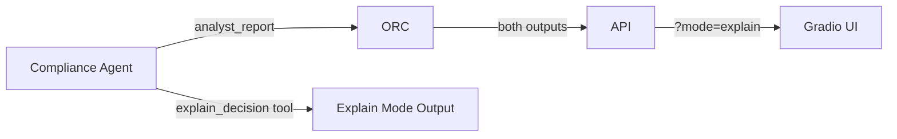

# Roadmap: ARGUS Explain Mode

**Status:** In progress — `explain_decision` tool wired in `agents/compliance/tools/explain_decision.py`
**Goal:** A parallel plain-language report version for end customers, NGO caseworkers, and non-technical reviewers.

---

## The problem

Every ARGUS report is currently written for a compliance analyst. The language assumes familiarity with:
- Regulatory frameworks (FATF, AMLD, BSA)
- Risk tier semantics (what "HIGH" means operationally)
- Foundry IQ citation format (KB-Regulations › FATF-40 › R.16)
- What "Enhanced Due Diligence" actually requires

A refugee applying for a bank account, an NGO caseworker explaining a rejection to their board, or a small business owner trying to understand why they've been flagged — none of them can use this report as-is.

---

## What Explain Mode produces

Same underlying data. Different output.

**Analyst output (current):**
> Risk Tier: HIGH | Score: 82 | Regulatory trigger: FATF R.16 (correspondent banking) | Gap: No beneficial owner documentation beyond 25% threshold | Recommended action: Enhanced Due Diligence — obtain notarized UBO declaration within 14 days

**Explain Mode output (target):**
> **What happened:** We reviewed this account application and found some things we need to look into more carefully before we can proceed.
>
> **What we found:** The way money has been moving through accounts connected to this application raised a flag in our checks. This is a standard review for certain types of transactions — it doesn't mean we've found anything wrong.
>
> **What happens next:** A compliance officer will review this personally and reach out within 5 business days. You may be asked to provide some additional documents confirming the ownership structure of your organization. This is a normal part of the process.
>
> **If you have questions:** Contact our compliance team at [email]. Reference number: RPT-2026-4892.

---

## Architecture

The `explain_decision` tool already exists in `agents/compliance/tools/explain_decision.py`. In v2 it becomes a first-class output path.

The Gradio UI gains a toggle:
- "Analyst Report" (default) — current output
- "Plain Language" — Explain Mode output

Both are generated in the same compliance agent pass. No extra latency.

---

## Prompt design

The `explain_decision` tool calls the LLM with a system prompt that enforces:
- Plain English (Flesch-Kincaid grade level ≤ 8)
- No acronyms without expansion
- Active voice
- Empathetic, non-judgmental framing ("we found some things to look into" not "you are high risk")
- Always includes: what happened, what was found, what happens next, who to contact
- Never includes: raw scores, regulatory citation codes, internal tool names

---

## Localization

Explain Mode is the natural first step for i18n — the plain language version is easier to translate than the analyst report. Target languages for v2:
- Spanish (es) — largest unbanked population in Latin America
- French (fr) — West Africa NGO operations
- Arabic (ar) — Middle East/North Africa microfinance
- Amharic (am) — Ethiopia, one of the largest microfinance markets

---

## Rollout plan

- [ ] Wire `explain_decision` into compliance agent as a parallel tool call
- [ ] Add `?mode=explain` query param to `/api/v1/kyc/report/{id}` endpoint
- [ ] Add toggle to Gradio UI (screen-reader accessible — `aria-pressed` toggle button)
- [ ] Add Flesch-Kincaid grade level assertion to Explain Mode tests
- [ ] Add localization scaffold (i18n strings in `explain_mode/locales/`)
